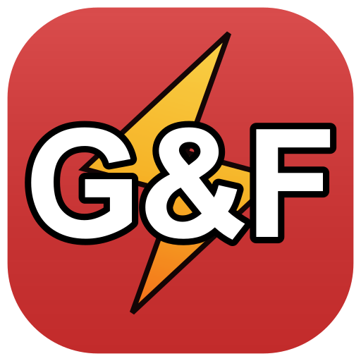

<!-- markdownlint-disable MD033 MD041 -->
<p align="center">
  
</p>

<h1 align="center">G&F Portal EU</h1>

<p align="center">
  <strong>Desktop application for the G&F Elektro project management portal</strong>
</p>

<p align="center">
  
  
  
  
</p>

---

## About

**G&F Portal EU** is a lightweight desktop wrapper for [portal.gfelektro.com](https://portal.gfelektro.com) — the internal project management platform used by G&F Elektro s.r.o. to coordinate electrical installation teams across Germany.

The app provides a native desktop experience with:

- Full-screen web view — No browser chrome, toolbars, or address bars
- Native notifications — Portal page notifications appear as native desktop notifications
- System tray integration — Minimize to tray, always accessible with one click
- Single instance — Only one instance of the app can run at a time
- External link handling — External links open in your default browser
- macOS Homebrew updates — Tray *Check for Update* runs `brew upgrade --cask gfe-portal-eu`

---

## Installation

### macOS (Homebrew — recommended)

```bash
brew tap KurtStevenK/tap
brew install --cask gfe-portal-eu
```

Upgrade later:

```bash
brew upgrade --cask gfe-portal-eu
```

Or use the tray menu item **Nach Updates suchen** / **Check for Update**.

The cask installs `/Applications/G&F Portal EU.app` and clears Gatekeeper quarantine (`xattr` / `chmod`) in a postflight step (unsigned builds without an Apple Developer ID).

If you previously installed **G&F Elektro Portal**, delete the old app from Applications after installing the new name.

If Homebrew asks you to trust a third-party cask:

```bash
brew trust --cask KurtStevenK/tap/gfe-portal-eu
```

### Pre-built Installers

Download the latest release from the [Releases](https://github.com/GF-Elektro/Portal-App/releases) page:

| Platform | File                               | Notes                        |
| -------- | ---------------------------------- | ---------------------------- |
| Windows  | `GFElektroPortal-x.x.x-Setup.exe` | NSIS Desktop Installer       |
| Windows  | `GFElektroPortal-x.x.x.exe`       | Portable Windows App         |
| macOS    | `GFElektroPortal-x.x.x.dmg`       | Installs as **G&F Portal EU** |
| Linux    | `GFElektroPortal-x.x.x.AppImage`  | Portable Linux executable    |
| Linux    | `GFElektroPortal-x.x.x.deb`       | Debian/Ubuntu package        |

### Building from Source

#### Prerequisites

- [Node.js](https://nodejs.org/) v18 or later
- [Git](https://git-scm.com/)
- Windows: No additional requirements
- macOS: Xcode Command Line Tools

#### Steps

```bash
# Clone the repository
git clone https://github.com/GF-Elektro/Portal-App.git
cd Portal-App

# Install dependencies
npm install

# Run in development mode
npm start

# Build for the current platform
npm run build

# Windows installers on this machine
npm run build:win

# macOS DMG on a Mac
npm run build:mac
```

The built binaries will be generated in the `release/` directory.

---

## Usage

### Starting the App

Launch **G&F Portal EU** from Applications (macOS), Start Menu (Windows), or your desktop environment (Linux). The portal loads automatically.

### System Tray

When you **minimize** or **close** the window, the app minimizes to the system tray instead of quitting. Right-click the tray icon for:

1. *Version* — current app version
2. *Portal öffnen* — show the portal window
3. *Neu laden* — reload the portal
4. *Nach Updates suchen* (macOS) — `brew upgrade --cask gfe-portal-eu`
5. *Tray-Symbol* — tray icon preset
6. *Benachrichtigung testen* — test OS notification
7. *Sprache* / *Fenstergröße* — language and window size
8. *Beenden* — quit

### Notifications

The app automatically bridges web notifications from the portal to your operating system's notification center. Make sure notifications are enabled in your system settings.

---

## Development

### Project Structure

```text
gf-elektro-portal/
├── build/
│   ├── icon.ico                  # Windows icon
│   ├── dmg-background.png        # DMG installer background
│   ├── mac-tray-*Template.png    # macOS menu bar icons
│   ├── tray-*.png                # Windows tray icons
│   └── flags/                    # Tray language flags
├── icon-192.png
├── icon-512.png                  # macOS / Linux app icon
├── icon.png
├── scripts/
│   └── create-ico.js             # PNG to ICO converter
├── src/
│   ├── main.js                   # Electron main process
│   ├── preload.js
│   └── toast-preload.js
├── package.json
├── CHANGELOG.md
└── README.md
```

### Key Technologies

- **[Electron](https://www.electronjs.org/)** — Cross-platform desktop apps with web technologies
- **[electron-builder](https://www.electron.build/)** — Build tooling and distribution
- **[NSIS](https://nsis.sourceforge.io/)** — Windows installer target via electron-builder

### Scripts

| Command              | Description                                |
| -------------------- | ------------------------------------------ |
| `npm start`          | Run the app in development mode            |
| `npm run build`      | Build executables for the current platform |
| `npm run build:win`  | Build Windows NSIS and portable packages   |
| `npm run build:mac`  | Build the macOS DMG on a Mac               |
| `npm run build:linux` | Build Linux AppImage and deb packages     |
| `npm run create-ico` | Regenerate the Windows icon from PNG       |

---

## Configuration

The portal URL and other constants are defined in `src/main.js`:

```javascript
const PORTAL_URL = 'https://portal.gfelektro.com';
const APP_NAME = 'G&F Portal EU';
```

---

## License

This project is licensed under the [Apache License 2.0](LICENSE). See the [LICENSE](LICENSE) file for details.

---

<!-- markdownlint-enable MD033 -->
<p align="center">
  <sub>Built with care by <a href="https://www.gfelektro.com">G&F Elektro s.r.o.</a></sub>
</p>
